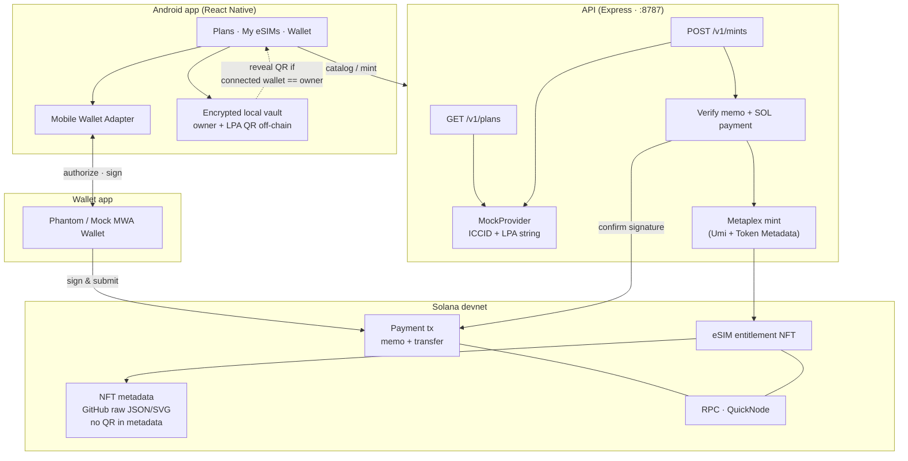
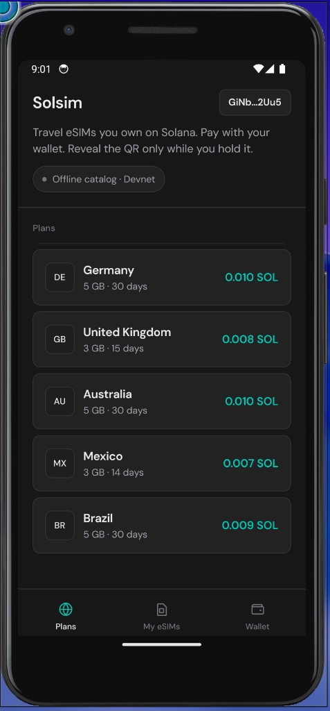
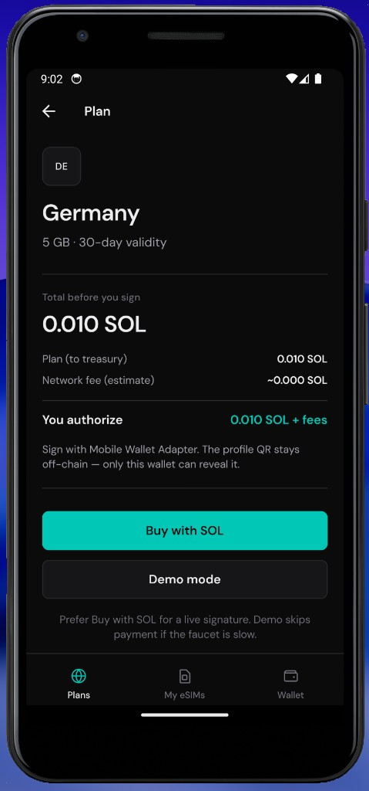
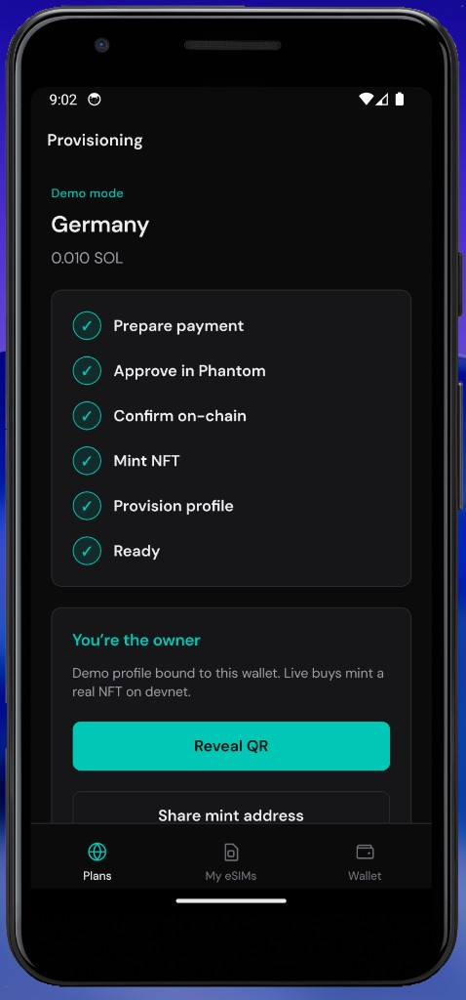
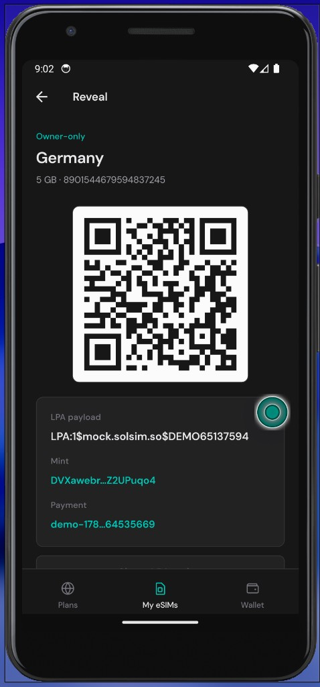
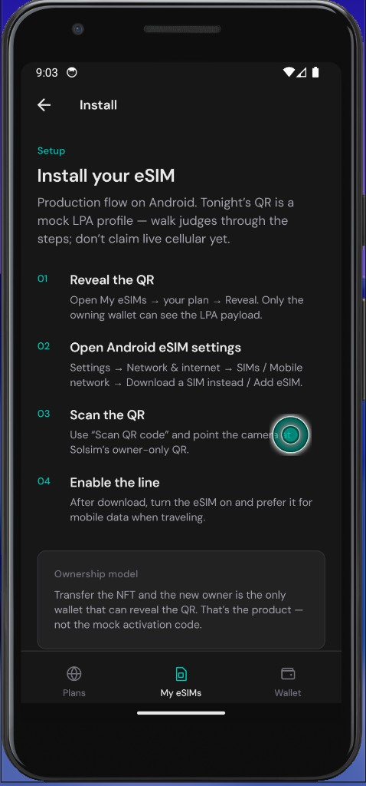

# Solsim

**Seeker-native DeFi eSIM** — buy travel data with Solana, own it on-chain, reveal the install QR only if you still hold the wallet.

Hackathon MVP: browse plans, pay on **Solana devnet**, mint a **real Metaplex NFT** to the buyer, reveal a **mock LPA QR** only to the owning wallet. Production path: wholesale eSIM API, mainnet USDC/SKR, Solana dApp Store.

**Sponsors infra:** Solana RPC via [QuickNode](https://www.quicknode.com) (devnet).

## Architecture



**Invariant:** payment + NFT ownership are on-chain; the LPA / QR payload never goes in NFT metadata or public logs.

## App screens (for judges)

Demo path on Android — browse → buy/demo → owner-only QR → install guide.

| Plans catalog | Plan detail |
| :---: | :---: |
|  |  |

| Provisioning | Owner-only QR |
| :---: | :---: |
|  |  |

<p align="center">
  
</p>

<p align="center"><em>Install guide — walk the Android eSIM steps; tonight’s LPA is a mock profile.</em></p>

## Documentation

| Doc | Contents |
| --- | --- |
| [docs/BUSINESS.md](./docs/BUSINESS.md) | Vision, GTM, Seeker strategy |
| [docs/IMPLEMENTATION.md](./docs/IMPLEMENTATION.md) | Execution plan |
| [docs/PRD.md](./docs/PRD.md) | Product requirements · hackathon scope |
| [docs/APP.md](./docs/APP.md) | React Native client · MWA |
| [docs/DEMO.md](./docs/DEMO.md) | 90-second judge demo script |

## Repo layout

- `app/` — React Native (Android) client with Mobile Wallet Adapter
- `api/` — Express catalog + Metaplex mint (`GET /v1/plans`, `POST /v1/mints`)
- `shared/` — Shared TypeScript types
- `docs/` — Business, product, and app specs

## Prerequisites

See Solana Mobile [development setup](https://docs.solanamobile.com/get-started/development-setup):

- Node.js (`^20.19.4 || ^22.13.0 || >=24.3.0`)
- JDK 17, Android SDK, emulator or device
- MWA wallet: [Phantom](https://play.google.com/store/apps/details?id=app.phantom) or [Mock MWA Wallet](https://github.com/solana-mobile/mock-mwa-wallet)

## Run the API (required for live Buy with SOL mint)

```bash
cd api
npm install
cp .env.example .env

# Generate mint authority (once), fund it on devnet, paste secret into .env
npm run create-mint-authority
# → fund printed pubkey at https://faucet.solana.com (~1–2 SOL)
# → set MINT_AUTHORITY_SECRET=... and TREASURY_PUBKEY (must match app)

npm run dev          # http://localhost:8787
# curl http://localhost:8787/v1/plans
```

Emulator reaches the API at `http://10.0.2.2:8787`. Also:

```bash
adb reverse tcp:8787 tcp:8787
adb reverse tcp:8081 tcp:8081
```

Without the API (or mint authority), **Demo mode** still works offline. Live buys will fail at the mint step with a clear error.

NFT metadata JSON/SVG lives in `api/public/nft/` and is referenced via GitHub raw URLs so Phantom can fetch images after push.

## Run the app

**Demo-stable (recommended for judging)** — embeds the JS bundle so Metro is not required:

```bash
cd app
npm install
npm run android:stable
# optional for live mint API:
adb reverse tcp:8787 tcp:8787
```

**Dev loop (hot reload)** — needs Metro running:

```bash
cd app
npm install
npm start          # Metro
# other terminal:
npm run android
adb reverse tcp:8081 tcp:8081
adb reverse tcp:8787 tcp:8787
```

### Demo loop

- Bottom tabs: **Plans / My eSIMs / Wallet**
- MWA connect + **Buy with SOL** (memo + transfer on devnet)
- API mints Metaplex NFT → Phantom Collectibles (devnet)
- Mock QR in encrypted local vault → **owner-only reveal**
- `FLAG_SECURE` on QR screen
- **Demo mode** fallback if faucet/SOL/API is unavailable (still needs a connected wallet)

See [docs/DEMO.md](docs/DEMO.md) for the pitch script (including emulator + Mock MWA).

## Next

**Post-hackathon (eng):** Postgres purchase saga, collection NFT, `GET /esims/:mint/qr` with chain owner check. See [PRD](./docs/PRD.md).

**Product:** Wholesale POC on Seeker → mainnet → dApp Store. See [BUSINESS.md](./docs/BUSINESS.md) and [IMPLEMENTATION.md](./docs/IMPLEMENTATION.md).
