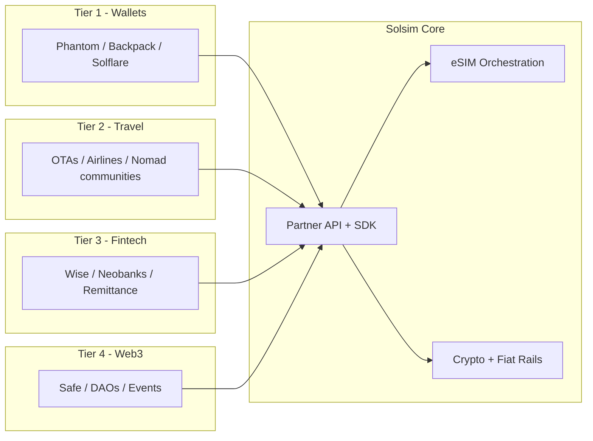

# Solsim — Business & Marketing Strategy

**Version:** 1.0  
**Date:** August 6, 2026  
**Status:** Draft  
**Audience:** Leadership, Partnerships, Marketing, Product

**Related docs:** [IMPLEMENTATION.md](./IMPLEMENTATION.md) (execution plan) · [PRD.md](./PRD.md) · [APP.md](./APP.md)

---

## 1. Executive summary

**Solsim** is a DeFi-native eSIM platform built for the **Solana Seeker** ecosystem. Users buy global travel data with **USDC / SKR** via Seed Vault, install profiles in-app, and own plan entitlements on-chain.

**Thesis:** Treat mobile data as a **composable on-chain utility**, not a siloed telco product.

| Phase | Ambition |
|---|---|
| **Wedge** | Seeker-native travelers buy eSIMs with USDC in under 60 seconds |
| **Platform** | Wallets, travel apps, and neobanks embed connectivity via API |
| **End state** | Default connectivity layer for Web3 — “Stripe for data” on Solana |

**North star:** Monthly Active eSIMs (MAE), with partner-attributed GMV as the Phase 2+ metric.

---

## 2. Vision & positioning

### 2.1 Vision statement

> **Borderless connectivity, owned by the network — not gatekept by carriers.**

Solsim makes global mobile data **permissionless, transparent, and interoperable** by combining wholesale eSIM infrastructure, Solana-native checkout, and open partner APIs.

### 2.2 Positioning

**Primary:** *The travel eSIM built for Seeker — pay with crypto, install in one tap.*

**Secondary (B2B):** *The connectivity API for crypto and cross-border apps.*

We compete on **embeddability and programmable ownership**, not on being the cheapest gigabyte on day one.

### 2.3 What we are / are not

| We **are** | We **are not** |
|---|---|
| Seeker-first travel eSIM with on-chain ownership | A Layer-1 or general DeFi protocol |
| Connectivity orchestration + DeFi checkout | A full MVNO with our own radio network (Phase 1–2) |
| B2B embeddable data API for Web3 partners | Voice/SMS bundle replacement (initially) |

---

## 3. Seeker integration (primary distribution)

Solana Mobile’s [Seeker](https://solanamobile.com/seeker) is the **anchor device and distribution channel** for Phase 0–2.

### 3.1 Hardware fit

| Seeker capability | Solsim use |
|---|---|
| **1 nano SIM + 1 eSIM slot** | Travel eSIM on eSIM slot; Helium or physical SIM on nano |
| **Seed Vault + MWA** | Pay USDC/SKR without leaving the app |
| **Seeker ID (.skr)** | Device-verified users, loyalty, airdrops |
| **dApp Store** | Primary distribution (no OEM pre-install) |

### 3.2 Competitive landscape on Seeker

| App | Model | Implication |
|---|---|---|
| [**Unbound**](https://unboundsim.com/) | Travel eSIM, Solana + card pay | Direct competitor on dApp Store |
| [**Helium Mobile**](https://support.hellohelium.com/en/articles/12013414-solana-seeker-promotion) | US domestic MVNO | Complement, not substitute — US daily driver vs. travel eSIM |
| **encryptSIM** | Hackathon concept (eSIM + dVPN) | Adjacent; data-only focus first |

**Moat vs. Unbound:** SKR-native checkout and staking discounts, Seeker Genesis Token perks, Seed Vault double-tap UX, on-chain NFT ownership model, partner API surface.

### 3.3 Solana Mobile partnership path

Per [Solana Mobile partnership FAQ](https://docs.solanamobile.com/marketing/faq):

- Ship via **dApp Store** — no exclusive telco slot
- **Co-marketing** available for engaged dApp Store apps
- **Device verification** flows (wallet-sign attestation, similar to Helium promo)

**Launch checklist:**

1. Android app with MWA + wholesale API integration
2. dApp Store submission ([docs](https://docs.solanamobile.com/))
3. Seeker device verification for Genesis Token perks
4. Apply for co-marketing once live with traction
5. dApp Store quests / Season rewards for connectivity usage

### 3.4 Seeker-specific product levers

| Lever | Mechanism |
|---|---|
| **SKR-native checkout** | Pay/stake SKR for discounts (aligns with SKR launch Jan 2026) |
| **Genesis Token perks** | Verified-device users get extra GB or priority routes |
| **Seed Vault UX** | Hardware-native purchase confirmation |
| **Helium complement** | Position as “US on Helium, abroad on Solsim” |
| **On-chain ownership** | eSIM entitlement as NFT; transferable / auditable |

---

## 4. Wholesale eSIM supply

Wholesale providers are **available now**. Solsim resells data VAS on top of aggregator infrastructure — we do not operate spectrum in Phase 1.

### 4.1 Provider shortlist

| Priority | Provider | Rationale |
|---|---|---|
| **#1** | [**1GLOBAL**](https://www.1global.com/telco-as-a-service) | In-app eSIM install SDK; fintech embed precedent (Revolut, N26) |
| **#2** | [**eSIM Access**](https://esimaccess.com/) | In-app activation SDK, no MOQ, crypto-native stacks |
| **#3** | [**Telna**](https://www.telna.com/connect-flex) | 200+ countries, Connect Flex for fast launch |
| **#4** | [**eSIM Go**](https://esimgo.com/) | Mature Travel API, tier-1 routing (~$1k initial float) |
| **Backup** | [Airalo Partners](https://partners.airalo.com/) | Largest catalog; less differentiated on native install |

**POC plan:** Run parallel evals on **1GLOBAL + eSIM Access** — same 5 countries, measure P95 provision time, wholesale $/GB, and one-tap install success on Seeker hardware.

### 4.2 Commercial reality

| Topic | Expectation |
|---|---|
| Minimum commitment | $0 / no MOQ (eSIM Access, PikaSim) to ~$1,000 prepaid (eSIM Go) |
| Gross margin | Typically 25–40% on travel data; volume unlocks better rates |
| Compliance | Resell data VAS; KYC tiers for larger plans; OFAC wallet screening |
| Seeker constraint | One active eSIM profile on eSIM slot — design for **top-up**, not multi-profile switching |

### 4.3 Supply architecture

```
Seeker App → Solsim API → Wholesale (1GLOBAL / eSIM Access / Telna)
                              → SM-DP+ provisioning → eSIM slot
```

Typical flow: pick plan → pay USDC/SKR → backend confirms → wholesale API → LPA/ICCID (~5–30s) → Android eSIM API or partner SDK installs profile.

---

## 5. Business integration (partner tiers)

Solsim is **embed-first**: every consumer feature must exist as an API endpoint partners can call.



### 5.1 Partner segments

| Tier | Partners | Integration | Rev share |
|---|---|---|---|
| **1 — Wallets** | Phantom, Backpack, Solflare, OKX | Embedded module, deep links, MWA | 15–25% net margin |
| **2 — Travel** | OTAs, airlines, nomad communities | Pre-trip upsell, itinerary-aware API | Affiliate / rev share |
| **3 — Fintech** | Neobanks, remittance | Bundle data with cross-border send | Wholesale + SaaS |
| **4 — Web3** | Safe, DAOs, event orgs | Treasury bulk buy, claim links, NFT subs | Volume discounts |
| **5 — DePIN** | Helium, aggregators | Roaming fallback, usage oracle | Strategic / cost-plus |
| **6 — Enterprise** | IoT, logistics (Phase 3+) | REST + MQTT, SIM lifecycle API | Contract commit |

### 5.2 White-label levels

| Level | Branding | Time to launch |
|---|---|---|
| **L1 Referral** | Solsim branded; partner ref link | ~1 week |
| **L2 Embedded** | Partner logo + colors in checkout | 2–3 weeks |
| **L3 Co-brand** | Joint SKUs (“Partner × Solsim”) | 4–6 weeks |
| **L4 Full white-label** | Partner brand everywhere | 8–12 weeks |

### 5.3 Y1 integration targets

| Metric | Target |
|---|---|
| Production API partners | ≥8 |
| Partner-attributed GMV | ≥40% of total |
| Embed vs. standalone conversion | ≥1.3× lift |
| Provisioning SLA | ≥99.5% success within 60s |

---

## 6. Economics: breakage, prepaid, & staking rewards

Solsim’s unit economics combine **wholesale margin** on data sold with **breakage** on prepaid capacity never consumed, and **staking rewards** that incentivize longer commitments while tying users to the SKR ecosystem.

```mermaid
flowchart TB
    subgraph Revenue [Revenue stack]
        GMV[Plan GMV]
        BR[Breakage margin]
        WH[Wholesale spread]
    end
    subgraph Prepaid [Long-term prepaid SKUs]
        P3[3-month pass]
        P6[6-month pass]
        P12[12-month pass]
    end
    subgraph Stake [Staking rewards]
        LOCK[Plan NFT locked]
        SKR[SKR stake optional]
        YLD[Bonus data + SKR yield]
    end
    GMV --> WH
    GMV --> BR
    P3 & P6 & P12 --> LOCK
    LOCK --> SKR --> YLD
    BR -.->|funds reward pool| YLD
```



### 6.1 Breakage — margin from unused prepaid value

**Breakage** is revenue recognized when a customer prepays for data or time but does not fully consume it before expiry. In travel eSIM, this is the primary “hidden” margin lever alongside wholesale spread.

| Breakage type | Example | Who keeps value |
|---|---|---|
| **Unused data** | Paid for 20 GB, used 8 GB, plan expires | Solsim (wholesale was likely pooled; unused MB never billed downstream) |
| **Unused time** | 30-day plan, travel ended day 12, no top-up | Remaining validity has zero marginal cost |
| **Never activated** | Purchased at conference, QR never installed | Full plan margin minus refund window |
| **Partial corridor mismatch** | Global pass but user only visited one country | Higher effective $/GB vs. actual wholesale draw |

**Industry baseline (directional):** prepaid travel eSIM breakage often runs **25–45%** of sold GB or **15–30%** of GMV, depending on SKU mix (short trip packs break less; annual nomad packs break more).

**Solsim modeling assumptions (Y1 planning):**

| SKU class | Expected breakage (% of sold data) | Notes |
|---|---|---|
| 7–14 day trip packs | 20–30% | Lower; high utilization pressure |
| 30-day regional | 30–40% | Default corridor SKU |
| 3-month prepaid pass | 35–45% | Nomads over-buy for peace of mind |
| 6–12 month prepaid pass | 40–55% | Highest breakage; also highest staking attach |

**How breakage funds the business (transparent model):**

1. Price long-term SKUs with **modest headline discount** (5–15% vs. monthly equivalent) — not a loss leader.
2. Model **breakage-adjusted margin** in finance; do not rely on breakage to subsidize below-wholesale pricing.
3. Allocate a **fixed % of expected breakage** (e.g. 20–30%) to the **Staking Rewards Pool** (§6.3) — aligns user benefit with unit economics without promising revenue share.
4. Report aggregate **utilization rate** quarterly in partner dashboard (B2B) — builds trust with integrators.

**User-facing transparency (required):**

- Show **“X GB remaining · expires DATE”** prominently; push alerts at 80% data and 7/3/1 days to expiry.
- Terms: unused data **does not roll over** unless on a Staking Pass (§6.3) with explicit rollover rules.
- No dark patterns — breakage is a business fact, not something we optimize via hidden throttling.

**Risks if breakage is mismanaged:**

| Risk | Mitigation |
|---|---|
| User backlash (“paid for data I lost”) | Proactive alerts; optional top-up transfer to new ICCID |
| Over-discounting long SKUs | Floor price ≥ wholesale + 15% at zero breakage |
| Regulatory (prepaid treatment) | Data VAS framing; clear expiry in checkout consent |
| Partner rev-share disputes | Attribute breakage margin in net revenue definition in MSA |

---

### 6.2 Prepaid plan ladder (3 / 6 / 12 months)

Long-term prepaid SKUs are the **staking rewards entry point**. Shorter trip packs remain pay-as-you-go with optional SKR checkout discount only.

| SKU | Target user | Typical allowance | vs. 30-day equivalent | Staking eligible |
|---|---|---|---|---|
| **Trip** (7–30 d) | One-off traveler | 3–20 GB | Baseline pricing | No |
| **Quarter Pass** (90 d) | Frequent corridor traveler | 30–60 GB pooled | ~8% off | Yes |
| **Half-year Pass** (180 d) | Digital nomad | 60–120 GB pooled | ~12% off | Yes |
| **Annual Pass** (365 d) | Permanent nomad / remote worker | 120–250 GB pooled | ~15% off | Yes |

**Pooled GB model:** one ICCID, data draws down across any covered country in the pass region (e.g. “Global”, “EU+UK”, “APAC”). Top-up always available at staker rate.

**On-chain representation:** Staking Pass = **locked SFT/NFT** with attributes `{ tier, gbTotal, gbRemaining, validUntil, stakedAt, stakeTier }`. Non-staking purchases remain standard transferable NFT until expiry.

---

### 6.3 eSIM Staking Rewards Plan

Users who buy **Quarter / Half-year / Annual** passes can opt into **eSIM Staking** — lock the plan entitlement on-chain for the prepaid term and earn additional benefits. This is distinct from (and composable with) **SKR wallet staking**.

#### 6.3.1 Two-layer staking model

| Layer | What is locked | Purpose |
|---|---|---|
| **Plan stake** | Prepaid eSIM SFT/NFT for 3 / 6 / 12 mo | Commitment; unlocks reward tier |
| **SKR stake** (optional) | SKR in program vault | Boosts rewards; Seeker ecosystem alignment |

Plan stake is **required** for rewards program. SKR stake is **optional multiplier**.

#### 6.3.2 Reward tiers (illustrative — tune at launch)

| Term | Plan stake lock | Min SKR stake | Base rewards | SKR boost |
|---|---|---|---|---|
| **3 mo** | Full 90 d | 0 SKR | 5% bonus data on purchase + usage alerts | +3% data if ≥500 SKR staked |
| **6 mo** | Full 180 d | 0 SKR | 10% bonus data + 1 courtesy corridor swap/mo | +5% data if ≥1,000 SKR staked |
| **12 mo** | Full 365 d | 0 SKR | 15% bonus data + priority routing + 2 swaps/mo | +8% data + SKR yield share if ≥2,500 SKR staked |

**Reward types (mix per tier):**

1. **Bonus data** — credited to same ICCID at purchase or monthly drip
2. **SKR incentives** — paid from Staking Rewards Pool (breakage-funded + ecosystem grant)
3. **Priority provisioning** — faster route during congestion (operational perk, no token cost)
4. **Rollover bank** — up to 10% of unused GB rolls once into next pass if renewed within 14 days (12 mo tier only)

#### 6.3.3 Staking lifecycle

```
Purchase Quarter+ Pass → opt-in “Stake & Earn” at checkout (or within 24h)
    → Plan SFT locked in program PDA (non-transferable until term ends)
    → Optional: stake SKR in same tx
    → Rewards accrue: bonus data immediate; SKR drip monthly
    → Term ends → plan unlocks (transferable/expired) + SKR unstake available
    → Early exit: forfeits unvested SKR rewards + 50% of bonus data (discourage gaming)
```

**Seeker integration:** Genesis Token holders auto-qualify for **+1 reward tier** (e.g. 3 mo treated as 6 mo benefits) without extra SKR.

#### 6.3.4 Staking Rewards Pool — funding

| Source | Allocation (% of pool inflow) |
|---|---|
| Breakage margin share | 50–60% |
| SKR ecosystem / Solana Mobile co-marketing grant | 20–30% |
| Partner co-op (wallet embed launch) | 10–20% |

Pool is **not** a revenue share to users — it funds **fixed-campaign incentives** with disclosed caps. Legal review before any “yield” language.

#### 6.3.5 Guardrails

| Do | Don't |
|---|---|
| Lock plan NFT via program with clear unlock date | Promise APY tied to Solsim revenue |
| Cap total SKR emissions per quarter | Require token to buy basic 7-day plan |
| Show live “rewards earned / remaining pool” | Hide expiry or breakage rules |
| Allow grace top-up before expiry | Auto-renew without explicit opt-in |

---

### 6.4 Phase 1 checkout (no staking program yet)

| Feature | Description |
|---|---|
| **Stablecoin checkout** | USDC on Solana (primary); SKR where integrated |
| **On-chain receipts** | Tx hash linked to order; NFT represents entitlement |
| **Refunds** | Auto USDC refund if provisioning fails |
| **Ownership model** | Metaplex NFT; QR/LPA gated to on-chain owner |
| **Breakage tracking** | Ops tags utilization at ICCID expiry for finance model |

### 6.5 Phase 2+ — SKR utility (composable with staking)

| Utility | Mechanism |
|---|---|
| **Trip discount** | Hold SKR → 5–10% off non-staking trip packs |
| **Staking boost** | Additional SKR stake → bonus data tiers (§6.3) |
| **Cashback** | % of **trip** spend rebated in SKR (vesting 90 d); staking passes use bonus data instead |
| **Governance** | Vote on country expansion + rewards pool allocation |
| **Data credits** | Transferable prepaid MB vouchers (non-staked plans only) |

**Avoid:** requiring token for basic purchase; revenue-linked “dividends”; opaque rebasing; marketing staking as investment product.

---

### 6.6 Unit economics summary

```
Effective gross margin ≈ wholesale spread + breakage margin − rewards pool − partner rev share

Example (Annual Pass, illustrative):
  List price:           $180
  Wholesale COGS:       $95  (usage-weighted)
  Breakage benefit:     +$35 (assume 40% GB unused)
  Rewards pool accrual: −$12 (SKR + bonus data)
  Partner rev share:    −$15 (20% of net)
  Contribution margin:  ~$103 → ~57% before opex
```

Finance must model **utilization sensitivity**: if breakage falls 10 pts (users consume more), staking rewards pool contribution may need tuning.

---

## 7. Go-to-market

### 7.1 Phase 0 — Seeker wedge (Months 0–6)

- **Channel:** Solana dApp Store (Seeker-first)
- **Audience:** Crypto nomads, Seeker early adopters, Solana conference travelers
- **Corridors:** US→EU, US→JP/KR, US→LATAM
- **Content:** “eSIM with USDC on Seeker”, country landing pages, Farcaster / CT
- **Proof point:** One wallet embed or co-marketing with Solana Mobile

### 7.2 Phase 1 — Partner scale (Months 6–12)

- Partner API beta → GA
- 8+ live integrations
- Conference plans (Breakpoint, Token2049, Solana events)
- Referral program with wallet-native invite codes

### 7.3 Phase 2 — Platform (Months 12–24)

- Fiat on-ramp fallback
- Subscription NFT / transferable credits
- DePIN hybrid routing pilot (Helium complement)
- Enterprise M2M beta

### 7.4 Pricing strategy

- **Trip SKUs (7–30 d):** competitive parity with Airalo/Unbound; 0–5% premium acceptable for crypto convenience
- **Prepaid passes (3 / 6 / 12 mo):** 8–15% headline discount vs. stacked monthly — **margin-positive after modeled breakage**
- **Staking opt-in:** bonus data + SKR rewards, not deeper discounts — avoids racing to wholesale floor
- **SKR trip discount:** 5–10% off non-staked trip packs (Phase 2)
- **Partner SKUs:** maintain MAP; passes sold at fixed wholesale API rate to partners

---

## 8. Marketing plan

### 8.1 Brand narrative

| Pillar | Message |
|---|---|
| **Speed** | “Connected before immigration — pay and install in 60 seconds” |
| **Ownership** | “Your plan lives on-chain; you control access” |
| **Native** | “Built for Seeker — Seed Vault checkout, one-tap install” |
| **Borderless** | “USDC in, data out — 190+ countries” |
| **Earn** | “Stake your annual pass — bonus data + SKR rewards while you roam” |

### 8.2 Channel mix (Y1)

| Channel | Role | KPI |
|---|---|---|
| **dApp Store / Seeker** | Primary acquisition | Installs, MAE |
| **Solana Mobile co-marketing** | Credibility + burst | Featured placement conversions |
| **Crypto Twitter / Farcaster** | Awareness | Wallet connects |
| **Nomad / travel SEO** | Intent capture | Organic checkout |
| **Conference activations** | Bulk + brand | Event plan redemptions |
| **Partner embeds** | Scaled GMV | Partner-attributed revenue |

### 8.3 Launch campaigns

1. **Seeker launch bundle** — Genesis Token holders: bonus GB on first purchase
2. **“First trip free”** — devnet/demo credits for hackathon; mainnet promo capped
3. **Referral** — both sides get SKR or data credit on successful referral
4. **DAO / event packs** — treasury-friendly bulk SKUs for hackathons and IRL crypto events

### 8.4 Competitive messaging vs. Unbound

| Them | Us |
|---|---|
| Card + crypto pay | **Seeker-native** Seed Vault + SKR-first |
| Standard eSIM app | **On-chain ownership** (NFT entitlement) |
| Standalone app | **Partner API** — embed in any wallet |
| QR-code centric | **One-tap install** via wholesale SDK |

---

## 9. Success metrics

### 9.1 Business (Y1 / Y2)

| KPI | Y1 | Y2 |
|---|---|---|
| GMV | $2M | $12M |
| Monthly active eSIMs | 15K | 100K |
| Partner % of GMV | 40% | 65% |
| Gross margin | 25% | 32% |
| Breakage-adjusted margin lift | +8 pts | +10 pts |
| Staking pass attach (Quarter+ buyers) | 25% | 40% |

### 9.2 Product

| KPI | Target |
|---|---|
| Checkout conversion (connect → paid) | ≥35% |
| Provisioning success | ≥99% |
| Time to first connectivity | <5 min median |
| 30-day top-up repeat | ≥20% |
| GB utilization rate (sold → consumed) | 55–70% (by design) |
| Staking pass opt-in at checkout | ≥30% of eligible SKUs |

### 9.3 Seeker-specific

| KPI | Target |
|---|---|
| dApp Store install → first purchase | ≥25% |
| One-tap install success (Seeker) | ≥95% |
| SKR payment share | ≥30% of GMV (post SKR launch) |
| Genesis-verified user retention | ≥2× vs. non-verified |

---

## 10. Risks & mitigations

| Risk | Mitigation |
|---|---|
| Unbound entrenched on dApp Store | SKR utility, NFT ownership, superior install UX |
| MNO wholesale dependency | Multi-aggregator POC; country-level failover |
| Crypto payment friction | USDC primary; fiat on-ramp Phase 1 |
| Provisioning failure | Auto-refund + ops SLA |
| Regulatory (token / MT) | Data VAS model; geo-block; legal opinion pre-TGE |
| Single eSIM slot on Seeker | Top-up-first UX; clear “replace profile” flow |
| Breakage backlash / trust hit | Expiry alerts; rollover on Annual stake renew |
| Staking perceived as securities | Utility framing; capped pool; no APY promises |
| Over-funding rewards vs. actual breakage | Quarterly pool rebalance tied to utilization data |

---

## 11. Open decisions

| # | Question | Owner | Due |
|---|---|---|---|
| 1 | Primary aggregator: 1GLOBAL vs. eSIM Access vs. multi | Partnerships | Phase 0 |
| 2 | Brand lock: Solsim vs. co-brand with partner | Marketing | Phase 0 |
| 3 | Staking reward tiers + SKR boost thresholds | Product + SM | Pre-mainnet |
| 4 | Breakage assumption by SKU for pricing floor | Finance + Product | Phase 0.5 |
| 5 | Plan lock program: NFT vs. SFT vs. Anchor stake account | Eng | Phase 1 |
| 6 | Rollover rules (Annual tier) vs. strict expiry | Product + Legal | Phase 1 |
| 7 | MVNO vs. pure VAS per corridor | Legal | Phase 0 |
| 8 | Voice/SMS add-on or data-only | Product | Phase 2 |

---

## 12. Immediate next steps

1. **Book demos** with 1GLOBAL, eSIM Access, Telna — confirm Android in-app eSIM SDK + Seeker/Android 14 compatibility
2. **POC on Seeker hardware** — 10 test activations (US, JP, EU, LATAM)
3. **Define staking pass SKUs + reward tiers** — 3/6/12 mo pricing with breakage model and pool funding
4. **dApp Store submission plan** — MWA, Seed Vault, device attestation
5. **Hackathon demo** — devnet loop proves ownership model (see [PRD.md](./PRD.md) §C)

---

## Appendix — Document history

| Version | Date | Changes |
|---|---|---|
| 1.0 | 2026-08-06 | Initial business strategy; Seeker-first GTM; wholesale shortlist |
| 1.1 | 2026-08-06 | Breakage economics + eSIM Staking Rewards Plan (3/6/12 mo) |
